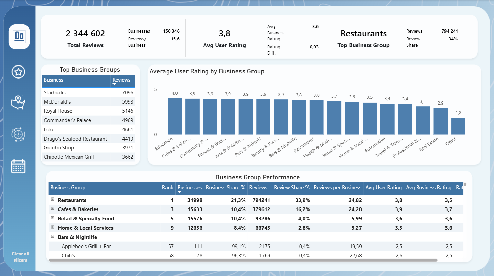
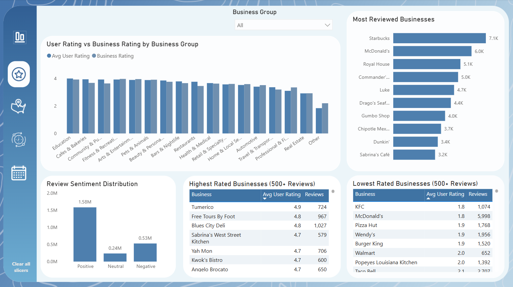
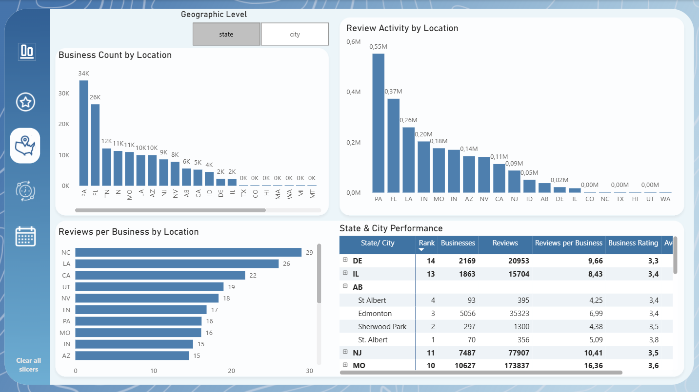
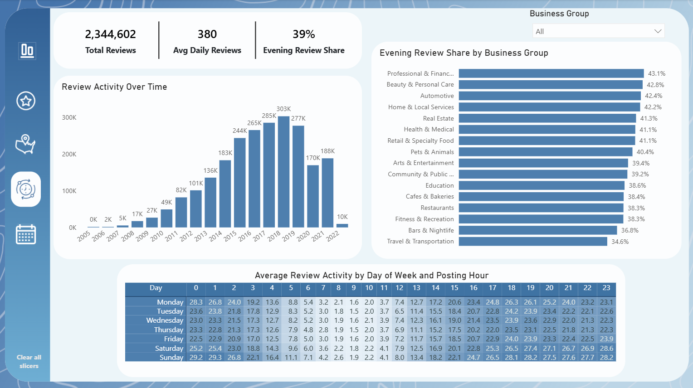
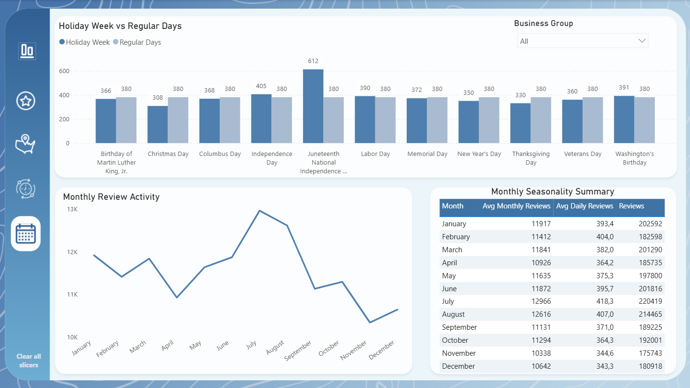

# Business Reviews Analysis

[View Interactive Power BI Dashboard](https://app.powerbi.com/view?r=eyJrIjoiMWZiY2M4NTEtYmZhZS00NGYwLTlhODktMGYyZDFhZWJjYWY3IiwidCI6Ijc1YzJlNGQ0LWQwNGMtNGNlOS1hMGVhLWM5NzViZGM0MTdlYiIsImMiOjF9&embedImagePlaceholder=true)

## Project Overview

This project presents an analysis of more than **2.3 million user reviews** covering approximately **150,000 businesses** across multiple cities and regions in North America.

The dataset includes businesses from a wide range of industries, including restaurants, cafes, retail, beauty and personal care, healthcare, transportation, entertainment, automotive services, and many others.

The main goal of the project was to explore:

- which businesses and business groups receive the highest number of reviews,
- how ratings differ across business categories,
- which businesses receive the highest and lowest ratings,
- when users are most likely to post reviews,
- how review activity changes over time,
- whether seasonal patterns can be observed,
- how review activity changes around U.S. federal holidays,
- how businesses and review activity differ across locations.

The final Power BI report consists of **five interactive pages**, moving from a general overview to more detailed analyses of ratings, geography, review activity, and seasonality.

## Data Source

The source data was provided in two file formats:

- CSV
- Parquet

The files contained information about businesses and user reviews.

The dataset included fields such as:

- business ID and business name,
- business categories,
- city and region,
- geographic coordinates,
- business rating,
- user rating,
- review date and posting time,
- user and review identifiers.

## Data Preparation

The data was imported into **Power BI** and transformed using **Power Query**.

The preparation process included:

- selecting and cleaning relevant columns,
- standardizing text values,
- preparing date and time fields,
- creating supporting dimensions for dates and posting hours,
- preparing geographic attributes,
- grouping detailed business categories into broader analytical categories,
- adding information about U.S. federal holidays.

One of the key transformation steps was the creation of the `business_group` field.

The original dataset contained a large number of detailed and overlapping business categories. These were consolidated into broader groups to make the analysis easier to interpret and compare.

Examples of the final business groups include:

- Restaurants
- Bars & Nightlife
- Cafes & Bakeries
- Beauty & Personal Care
- Retail & Specialty Food
- Travel & Transportation
- Health & Medical
- Automotive
- Arts & Entertainment
- Home & Local Services
- Fitness & Recreation
- Pets & Animals
- Education
- Real Estate
- Professional & Financial Services
- Community & Public Services

## Data Model

The report was built using a fact-and-dimension model.

The main fact table contains individual user reviews and is connected to supporting dimension tables containing information about:

- businesses,
- users,
- dates,
- posting hours,
- U.S. federal holidays.

A geographic field parameter was also created to allow users to dynamically switch between **State** and **City** levels on the Geography page.

## DAX Measures

DAX measures were created to support the analysis, including:

- total number of reviews,
- number of businesses,
- average user rating,
- average business rating,
- rating difference,
- reviews per business,
- review share,
- business share,
- average daily reviews,
- average monthly reviews,
- evening review share,
- holiday-related review activity,
- business and geographic rankings.

The measures react dynamically to filters and slicers used throughout the report.

# Dashboard Pages

## 1. Overview

The Overview page provides a high-level summary of the dataset and the most important business and review metrics.

It includes:

- **Total Reviews**
- **Avg User Rating**
- **Top Business Group**
- top reviewed businesses,
- average user rating by business group,
- a detailed **Business Group Performance** matrix.

The matrix allows business groups to be compared using metrics such as:

- number of businesses,
- business share,
- number of reviews,
- review share,
- reviews per business,
- average user rating,
- average business rating,
- rating difference.

The hierarchy can also be expanded to explore individual businesses within each business group.

## 2. Business Groups & Ratings

This page focuses on ratings and customer feedback across different business categories.

The analysis includes:

- comparison of **Avg User Rating** and **Business Rating** by business group,
- review sentiment distribution,
- most reviewed businesses,
- highest rated businesses,
- lowest rated businesses.

To make the rating rankings more reliable, the highest and lowest rated business lists include only businesses with at least **500 reviews**.

This reduces the influence of businesses with very high or very low ratings based on only a small number of reviews.

A **Business Group** slicer allows users to explore the same metrics for a selected category.

## 3. Geography

The Geography page explores how businesses, reviews, and ratings vary across different locations.

A dynamic **Geographic Level** selector allows users to switch between:

- State
- City

The page includes:

- **Business Count by Location**
- **Review Activity by Location**
- **Reviews per Business by Location**
- a hierarchical **State & City Performance** matrix.

The matrix contains:

- geographic rank,
- number of businesses,
- number of reviews,
- reviews per business,
- business rating,
- average user rating.

Regions can be expanded to explore individual cities.

This makes it possible to compare both the concentration of businesses and the level of customer engagement across different locations.

## 4. Review Activity

This page focuses on **when users post reviews**.

The main KPIs include:

- **Total Reviews**
- **Avg Daily Reviews**
- **Evening Review Share**

### Review Activity Over Time

This chart shows how the total number of reviews changed over the years.

Review activity increased strongly during the earlier years of the dataset, reached its highest level in 2019, and declined in the later period.

### Evening Review Share by Business Group

This chart shows what percentage of reviews within each business group were posted during evening hours.

It makes it possible to compare whether review-posting behaviour differs between industries.

### Average Review Activity by Day of Week and Posting Hour

A matrix with conditional formatting is used as a heatmap to show review activity across:

- days of the week,
- hours of the day.

The analysis shows that review activity is generally lowest during morning hours and increases later in the day, with particularly high activity during evening and late-night hours.

A **Business Group** slicer allows these patterns to be explored separately for different business categories.

## 5. Seasonality

The final page focuses on monthly patterns and review activity around U.S. federal holidays.

### Monthly Review Activity

The line chart shows the average monthly number of reviews across the calendar year and helps identify periods of higher and lower review activity.

Activity is highest during the summer months, particularly in July and August, while lower levels are visible toward the end of the year.

### Monthly Seasonality Summary

A supporting table provides exact monthly values, including:

- **Avg Monthly Reviews**
- **Avg Daily Reviews**
- **Reviews**

This complements the trend chart and makes month-to-month comparisons easier.

### Holiday Week vs Regular Days

Review activity during the **Holiday Week** is compared with the average activity observed on regular days.

For this analysis, the Holiday Week includes the holiday itself together with the seven preceding days.

This makes it possible to identify whether review activity around individual U.S. federal holidays is higher or lower than the typical daily level.

A **Business Group** slicer allows seasonal patterns to be analysed separately for different types of businesses.

## Key Findings

The analysis highlights several patterns in the data:

- **Restaurants** generate the largest share of all reviews.
- The number of reviews per business varies significantly between business groups.
- Average ratings across many business groups are relatively similar.
- Businesses with very high ratings often have fewer reviews, which is why a minimum review threshold was introduced in the rating rankings.
- Review activity is lowest during morning hours and increases later in the day.
- Evening review activity differs between business categories.
- Review volume increased substantially over time, reaching its highest level in 2019 before declining in later years.
- Monthly review activity shows moderate seasonal variation, with the highest activity during the summer months.
- Review activity around some U.S. federal holidays differs from the typical activity observed on regular days.
- Geographic analysis reveals differences in business concentration, review volume, and reviews per business across locations.

## Tools & Technologies

- **Power BI**
- **Power Query**
- **DAX**
- **CSV**
- **Parquet**
